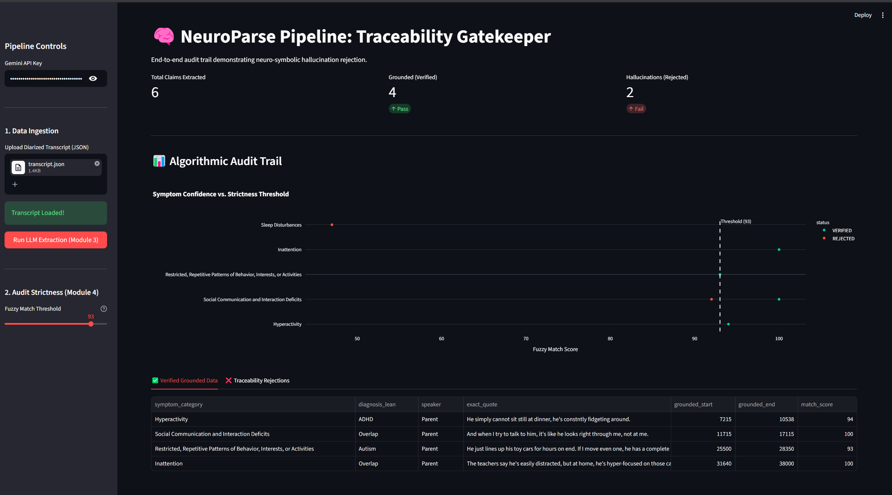

# NeuroParse: Neuro-Symbolic Traceability Gatekeeper 🧠

An interactive, neuro-symbolic pipeline designed to eliminate automation bias and LLM hallucinations in clinical intake systems. 

This prototype specifically addresses the complex diagnostic overlap between ADHD and Autism Spectrum Disorder (ASD) by mathematically forcing AI-extracted symptoms to ground themselves in exact sub-string timestamps from patient-clinician audio transcripts.



## 🚀 Features

- **Semantic Symptom Extraction:** Utilizes Google's Gemini 2.5 Flash to extract DSM-5 clinical criteria from messy, real-world ASR transcripts.
- **Mathematical Traceability (Module 4):** Employs fuzzy matching (`thefuzz`) and sub-string interpolation to link extracted clinical claims back to the exact millisecond of the source audio.
- **Deterministic Hallucination Rejection:** Automatically filters and rejects LLM inferences that fail the strictness threshold, providing a transparent audit trail.
- **Interactive UI:** Built with Streamlit and Plotly to visually demonstrate the dynamic gating and verification of clinical data.

## 🛠️ Tech Stack

- **Python 3.10+**
- **Streamlit** (Dashboard & Pipeline UI)
- **Google GenAI SDK** (Semantic Extraction)
- **TheFuzz & Difflib** (Neuro-Symbolic Verification)
- **Plotly** (Audit Trail Visualization)

## ⚙️ Installation & Usage

1. **Clone the repository:**
   ```bash
   git clone [https://github.com/Rishabh-G-Shetye/neuroparse-gatekeeper.git](https://github.com/Rishabh-G-Shetye/neuroparse-gatekeeper.git)
   cd neuroparse-gatekeeper
2. **Install Dependencies:**
    ```bash
   pip install streamlit plotly google-denai pydantic thefuzz python-dotenv
3. **Environmental Setup:**
    ```bash
   GEMINI_API_KEY=__
4. **Run the Dashboard:**
    ```bash
   streamlit run dashboard.py
   
## Author: Rishabh Shetye